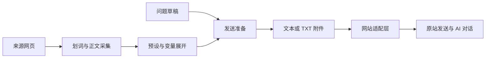

# Sider · 原版 AI 网页侧栏

**把正在读的网页，带进原版 AI 对话。**

Sider 是一个 Chromium 浏览器扩展：左边阅读网页，右边使用 ChatGPT、Gemini、Claude 等原版 AI 网站。选中文字、引用文章正文、套用自己的提示词，都可以在当前页面完成，无需反复复制粘贴或切换标签页。

侧栏中的模型、登录和聊天记录由 AI 原站提供。Sider 负责连接网页材料与提问，**无需 API Key**。

## 能做什么

| 你想做的事 | Sider 提供的能力 |
| --- | --- |
| 解释一个词、翻译一段话、看懂一段代码 | **划词提问**：选中原文，在侧栏写问题，发送时带上划词 |
| 总结文章、梳理技术文档 | **引用正文**：提取已加载的主要内容并转换为 Markdown，保留链接、列表、代码和表格 |
| 把长材料交给 AI 阅读 | **文本转附件**：正文默认超过 10,000 字符转为 TXT；各预设可独立设置阈值与附件区域 |
| 复用翻译、总结、评审等提示词 | **统一预设**：内置划词、链接、正文，也支持自建预设、变量、拖动排序和默认勾选 |
| 在当前对话中引用另一个网页 | **切换引用来源**：搜索所有窗口中的标签页，切换材料来源，保留当前对话、草稿和附件 |
| 使用自己常用的 AI 网站 | **网站适配**：内置三种网站，可添加自定义网站，并配置输入框与发送按钮 |

另外支持悬浮球、右键菜单和快捷键打开侧栏；悬浮球可拖动贴边、按网站显示或隐藏。网站与预设配置可导出、导入备份。

## 设计思路

### 保留原站体验

侧栏直接加载 AI 网站，使用它已有的模型选择、会话和文件上传。扩展围绕原站输入框增加预设与引用能力，消息仍通过原站发送。

### 材料由你选择，提问时再组合

划词、链接、正文和固定提示词都使用同一套“预设”。勾选决定下一条消息带什么，点击名称则执行替换、追加或直接发送。勾选不会改动正在编辑的草稿，成功发送后自动取消，方便逐次控制上下文。

正文按需采集，发送时引用会在发送前更新；主动追加的内容保留当时快照，方便继续编辑。采集或必要附件准备失败时保留草稿并提示原因。

### 侧栏与引用按标签页独立

每个标签页有自己的侧栏实例和临时引用选择。默认引用所属网页，也可以手动借用其他标签页的材料；切换来源只更新引用材料，当前 AI 对话继续保留。网站选择与预设定义是全局设置，网站变更在重载或重开侧栏后生效。

### 共用增强流程，分开适配网站

网页采集、变量展开、草稿保护和附件编排共用一套逻辑；网站适配层负责定位原站控件、上传文件和触发发送。自定义网站先自动识别，识别失败时可以点选发送按钮或指定 CSS 选择器。

## 安装

需要支持原生侧栏的 Chromium 浏览器，例如 Chrome、Edge 或 Tabbit。扩展要求 **Chromium 145 或更高版本**，并且能够访问所选 AI 网站。

准备好 Node.js、npm 和 Git，执行：

```sh
git clone https://github.com/ChinaYong/Sider.git
cd Sider
npm ci
npm run build
```

1. 打开 `chrome://extensions/` 或 `edge://extensions/`，开启 **开发者模式**。
2. 点击 **加载已解压的扩展**，选择项目中的 **`dist/`**。
3. 打开要阅读的网页，点击工具栏中的 Sider 图标。

如果已有构建好的扩展 ZIP，解压后直接加载包含 `manifest.json` 的目录即可。浏览器持续读取该目录，请保留它。

更新时重新构建，或用新扩展包更新原加载目录，然后在扩展管理页点击 **重新加载**，关闭旧侧栏并重开。`npm run build` 只生成 `dist/`，不会生成 ZIP。

## 快速上手

1. **打开侧栏**：在阅读网页点击 Sider 图标；首次使用按提示授权或登录 AI 网站。顶部 **⚙ AI 网站设置** 可切换网站。
2. **选择材料**：在网页划词，或打开输入框旁的 **预设**，勾选“网页链接”“网页正文”等需要的项。初始默认勾选“划词”。
3. **写问题并发送**：使用原站输入框、发送按钮或发送快捷键。Sider 在发送前准备所选材料，成功发送后取消勾选；下一次需要引用时重新选择。

例如，选中“闭包”，输入“用一个 JavaScript 例子解释它”，默认组合为：

```text
网页划词：
闭包

用一个 JavaScript 例子解释它
```

想引用其他网页，点击 **预设菜单顶部的来源标题**，搜索并选择标签页；点击 **↩ 当前页** 返回所属网页。

**勾选预设**表示随下一条消息引用；**点击预设名称**会立即按其配置执行替换、追加或直接发送。变量、附件、自定义网站等操作见 [使用指南](docs/usage.md)。

| 常用操作 | 入口 |
| --- | --- |
| 打开侧栏 | 工具栏图标、网页右键、`Ctrl+Shift+Y` |
| 打开／关闭侧栏 | 已显示的网页悬浮球 |
| 引用当前划词 | `Alt+Shift+Q` |
| 查看、复制或下载正文 | 正文预设标签 → 查看正文快照 |
| 备份网站与预设配置 | ⚙ AI 网站设置 → 配置导入／导出 |

## 网站与采集范围

内置 **ChatGPT、Gemini、Claude**。Gemini 可选择普通／Spark 界面及默认模型、思考设置。自定义网站支持 HTTP(S) 地址，文本引用与附件能力依原站控件检测启用。

网站能否嵌入、登录或上传，受原站页面、网络和账号状态影响。内置适配与本地回归覆盖不代表所有真实账号场景均已验证，具体范围见 [验证记录](docs/validation.md)。

正文采集针对**已加载的网页主要内容**，不包含尚未加载的段落、其他 iframe、图片或 Canvas 中的文字。浏览器内部页与已登记的 AI 网站页面不能作为引用来源。

## 数据与权限

- 网页材料在浏览器内采集；你选择的引用在发送时随问题或附件交给当前 AI 网站。
- 网站、预设和悬浮球设置存于浏览器本地；划词、正文快照及临时引用状态存于浏览器会话中。配置备份只包含扩展设置。
- 点击工具栏图标可获得当前网页的临时访问权，持续访问或读取其他来源网站时按需授权。`tabs` 权限用于列出标签页标题与网址，正文读取仍需相应网页访问权。
- 为让原站在侧栏中加载，扩展对侧栏内已登记 AI 网站的子框架响应设置嵌入兼容规则，调整 CSP 与 X-Frame-Options 响应头。

## 常见问题

| 情况 | 先尝试 |
| --- | --- |
| AI 网站无法加载或登录 | 点击右上角 `↗`，在普通标签页登录，再用 `↻` 重载侧栏 |
| 提示“网页引用未就绪” | 确认原站输入框已出现；重连或在网站设置中检查控件配置 |
| 划词或正文未出现 | 在来源网页点击一次工具栏图标，或按提示授权来源网站；确认正文已加载 |
| 附件上传失败 | 按提示检查原站附件区，在预设标签中重试或移除该项；也可将发送方式设为“始终文本” |

更多操作见 [使用指南](docs/usage.md)。

## 开发

技术栈：**Manifest V3、原生 JavaScript、esbuild、Readability + Turndown**。自动化测试使用 Node.js Test Runner、jsdom 和 Playwright。



| 模块 | 职责 |
| --- | --- |
| [background.js](src/background.js)、[panel.js](src/panel.js) | 标签页绑定、授权、侧栏加载与通信 |
| [page.js](src/content/page.js)、[extract.js](src/content/extract.js) | 划词采集、正文提取与 Markdown 转换 |
| [prompt-templates.js](src/prompt-templates.js)、[variables.js](src/variables.js)、[context.js](src/context.js) | 预设定义、变量展开与引用组合 |
| [enhancement.js](src/content/enhancement.js)、[template-draft.js](src/content/template-draft.js) | 原站输入区增强、预设交互与草稿保护 |
| [adapters.js](src/content/adapters.js)、[attachments.js](src/content/attachments.js) | 网站控件适配、附件编排与就绪检测 |
| [reference-sessions.js](src/reference-sessions.js) | 侧栏独立勾选与跨标签页引用来源 |
| [configuration.js](src/configuration.js) | 配置校验、迁移与导入／导出 |

| 命令 | 作用 |
| --- | --- |
| `npm ci` | 安装锁定版本的依赖 |
| `npm run build` | 构建可加载的 `dist/` |
| `npm test` | 运行单元测试 |
| `npm run test:browser` | 构建并运行隔离浏览器回归，见 [浏览器测试说明](docs/browser-tests.md) |
| `npm run check` | 运行单元测试并构建 |
| `npm run dev` | 启动安装提示与示例文章页面 |

完整侧栏需在浏览器中加载扩展。本地开发页面用于辅助调试，测试范围与历史结果见 [验证记录](docs/validation.md)。`dist/` 与扩展 ZIP 为生成产物，不随源码提交。
